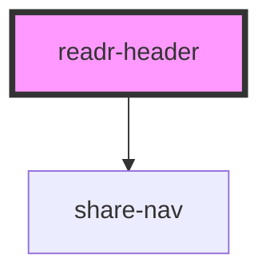

# readr-header

<!-- Auto Generated Below -->

## Properties

| Property             | Attribute               | Description | Type     | Default     |
| -------------------- | ----------------------- | ----------- | -------- | ----------- |
| `readrColor`         | `readr-color`           |             | `string` | `undefined` |
| `shareBtnColor`      | `share-btn-color`       |             | `string` | `'#000928'` |
| `shareFbBgColor`     | `share-fb-bg-color`     |             | `string` | `'#000928'` |
| `shareFbTextColor`   | `share-fb-text-color`   |             | `string` | `'#fff'`    |
| `shareLineBgColor`   | `share-line-bg-color`   |             | `string` | `'#000928'` |
| `shareLineTextColor` | `share-line-text-color` |             | `string` | `'#fff'`    |

## Events

| Event                | Description | Type               |
| -------------------- | ----------- | ------------------ |
| `readrLogoLinkClick` |             | `CustomEvent<any>` |

## Dependencies

### Depends on

- [share-nav](components)

### Graph

----------------------------------------------

*Built with [StencilJS](https://stenciljs.com/)*
