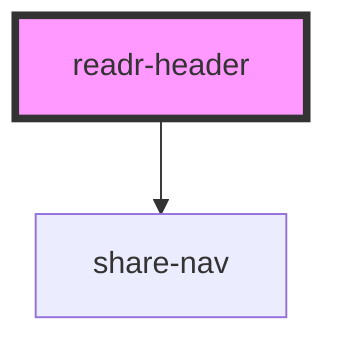

# readr-header

<!-- Auto Generated Below -->

## Events

| Event                | Description | Type               |
| -------------------- | ----------- | ------------------ |
| `readrLogoLinkClick` |             | `CustomEvent<any>` |

## Dependencies

### Depends on

- [share-nav](components)

### Graph

----------------------------------------------

*Built with [StencilJS](https://stenciljs.com/)*
